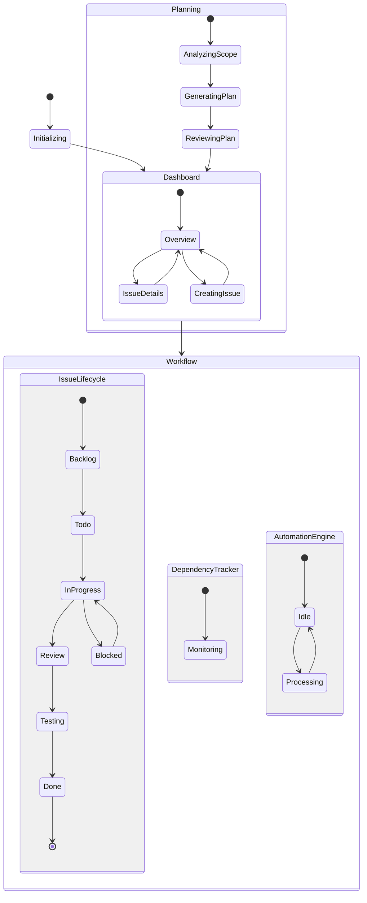

# 🎯 Plan d'Action Issues - State Machine Complète

## 📊 Vue d'Ensemble

Ce document définit le plan d'action étape par étape pour la gestion des issues GitHub via une state machine XState complète, basée sur le modèle `sceneMachine.js`.

## 🏗️ Architecture de la State Machine

### Machine Principale: `issueMachine`

La machine gère le cycle de vie complet des issues avec les états suivants :



## 📋 Plan d'Action Détaillé

### Phase 1 : Initialisation (Jour 1-2)

#### Étape 1.1 : Configuration de l'environnement
- [ ] Installer les dépendances XState
- [ ] Configurer l'intégration GitHub API
- [ ] Mettre en place la structure de fichiers

**Actions:**
```javascript
SYSTEM_READY → setRepositoryInfo
```

#### Étape 1.2 : Chargement des issues existantes
- [ ] Récupérer les issues depuis GitHub
- [ ] Mapper les labels aux statuts
- [ ] Initialiser les métriques

**État:** `initializing` → `dashboard`

### Phase 2 : Gestion du Workflow (Jour 3-7)

#### Étape 2.1 : Cycle de vie des issues
- [ ] **Backlog** : Issues en attente de priorisation
  - Action: `MOVE_TO_TODO` → Planifier l'issue
  - Action: `ARCHIVE` → Archiver les issues obsolètes

- [ ] **To Do** : Issues prêtes à être travaillées
  - Entry: `addToSprintPlan` - Ajouter au sprint
  - Action: `START_WORK` → Commencer le travail

- [ ] **In Progress** : Issues en cours de développement
  - Entry: `startTimer`, `notifyAssignee`
  - Action: `SUBMIT_FOR_REVIEW` → Soumettre en review
  - Action: `BLOCK_ISSUE` → Marquer comme bloquée
  - Timer: Rappel après 24h d'inactivité

- [ ] **Review** : Issues en cours de review
  - Entry: `requestReview` - Demander une review
  - Action: `APPROVE` → Passer aux tests
  - Action: `REQUEST_CHANGES` → Retour en développement

- [ ] **Testing** : Issues en phase de test
  - Entry: `runTestSuite` - Lancer les tests
  - Action: `TESTS_PASS` → Marquer comme terminée
  - Action: `TESTS_FAIL` → Retour en développement

- [ ] **Done** : Issues terminées
  - Entry: `stopTimer`, `updateMetrics`, `closeIssue`
  - État final

- [ ] **Blocked** : Issues bloquées
  - Entry: `identifyBlockers`
  - Action: `UNBLOCK` → Retour en développement (si possible)
  - Action: `ESCALATE` → Augmenter la priorité

#### Étape 2.2 : Gestion des dépendances
```javascript
// Tracker de dépendances
DEPENDENCY_ADDED → addDependency
DEPENDENCY_RESOLVED → resolveDependency
CHECK_DEPENDENCIES → validateDependencies
```

#### Étape 2.3 : Moteur d'automation
```javascript
// Automatisation des tâches répétitives
TRIGGER_AUTOMATION → processing
// Services: processAutomation
// - Auto-label
// - Auto-assign
// - Auto-milestone
```

### Phase 3 : Planning Intelligent (Jour 8-10)

#### Étape 3.1 : Analyse de scope
```javascript
analyzeProjectScope() → {
  totalEffort: 'low' | 'medium' | 'high',
  estimatedTime: string,
  resources: string[]
}
```

#### Étape 3.2 : Génération du plan
```javascript
generateActionPlan() → {
  steps: [
    { id, action, duration },
    ...
  ],
  totalDuration: string,
  dependencies: []
}
```

#### Étape 3.3 : Review et approbation
- [ ] `APPROVE_PLAN` → Exécuter le plan
- [ ] `MODIFY_PLAN` → Modifier le plan
- [ ] `REJECT_PLAN` → Annuler

### Phase 4 : Dashboard et Analytics (Jour 11-12)

#### Étape 4.1 : Vue d'ensemble
```javascript
// Métriques temps réel
analytics: {
  totalIssues: number,
  completedIssues: number,
  blockedIssues: number,
  averageTime: number
}
```

#### Étape 4.2 : Détails des issues
- [ ] Visualisation de l'état actuel
- [ ] Historique des transitions
- [ ] Temps passé par état

#### Étape 4.3 : Actions disponibles
```javascript
VIEW_ISSUE → selectIssue
CREATE_ISSUE → creatingIssue
FILTER_ISSUES → applyFilters
EDIT_ISSUE → editing
SAVE_CHANGES → saveIssueChanges
```

## 🔄 Flux de Travail Type

### Nouvelle Issue
1. `CREATE_ISSUE` → Créer une nouvelle issue
2. Auto-assignation au `backlog`
3. `MOVE_TO_TODO` → Planification
4. `START_WORK` → Début du développement
5. `SUBMIT_FOR_REVIEW` → Review de code
6. `APPROVE` → Validation
7. `TESTS_PASS` → Tests réussis
8. `Done` → Issue fermée

### Issue Bloquée
1. Issue en `inProgress`
2. `BLOCK_ISSUE` → Identification du blocage
3. `identifyBlockers` → Analyse des causes
4. Résolution du blocage
5. `UNBLOCK` → Retour en développement
6. Continuation du flux normal

## 📊 Métriques et KPIs

### Métriques Automatiques
- **Temps moyen par issue** : Calculé automatiquement
- **Taux de complétion** : `completedIssues / totalIssues`
- **Issues bloquées** : Nombre et durée moyenne
- **Vélocité de l'équipe** : Issues complétées par sprint

### Alertes et Notifications
- Issue inactive depuis 24h
- Dépendances non résolues
- Blocages critiques
- Échéances dépassées

## 🛠️ Configuration et Personnalisation

### Labels et Priorités
```javascript
priorities: ['critical', 'high', 'medium', 'low']

labels: {
  bug: { color: '#d73a4a' },
  enhancement: { color: '#a2eeef' },
  documentation: { color: '#0075ca' },
  xstate: { color: '#7057ff' }
}
```

### Statuts Personnalisés
```javascript
statuses: {
  backlog: { label: 'Backlog', color: '#6b7280' },
  todo: { label: 'To Do', color: '#3b82f6' },
  inProgress: { label: 'In Progress', color: '#f59e0b' },
  review: { label: 'In Review', color: '#8b5cf6' },
  testing: { label: 'Testing', color: '#10b981' },
  done: { label: 'Done', color: '#22c55e' },
  blocked: { label: 'Blocked', color: '#ef4444' }
}
```

## 🔗 Intégration avec l'Écosystème

### Connexion avec sceneMachine
```javascript
// Synchronisation des événements
sceneMachine.send('COLOR.UPDATE', { color: issueStatus.color })
sceneMachine.send('TRIGGER_ANIMATION', { type: 'issueComplete' })
```

### Intégration GitHub
```javascript
// Webhook events
on('issues.opened') → CREATE_ISSUE
on('issues.closed') → CLOSE_ISSUE
on('issue_comment.created') → ADD_COMMENT
on('pull_request.opened') → LINK_PR
```

## 📈 Roadmap d'Implémentation

### Semaine 1
- [x] Création de la machine d'état
- [ ] Tests unitaires de base
- [ ] Intégration GitHub API

### Semaine 2
- [ ] UI Dashboard
- [ ] Système de notifications
- [ ] Analytics en temps réel

### Semaine 3
- [ ] Automatisations avancées
- [ ] Machine Learning pour prédictions
- [ ] Optimisations de performance

## 🎯 Checklist de Validation

- [ ] Toutes les transitions d'état fonctionnent
- [ ] Les timers et delays sont configurés
- [ ] Les services async sont implémentés
- [ ] Les guards protègent les transitions
- [ ] Les actions modifient correctement le contexte
- [ ] Les métriques sont calculées en temps réel
- [ ] L'intégration GitHub est opérationnelle
- [ ] Les notifications sont envoyées
- [ ] Le dashboard affiche les bonnes données
- [ ] Les tests couvrent >80% du code

## 📚 Ressources

- [XState Documentation](https://xstate.js.org/docs/)
- [GitHub REST API](https://docs.github.com/en/rest)
- [State Machine Visualizer](https://stately.ai/viz)
- [sceneMachine.js Reference](/src/components/V20.0_XState/stores/xstate/machines/sceneMachine.js)

---

*Plan créé le : ${new Date().toISOString()}*
*Version : 1.0.0*
*Auteur : @Dev-Moulin & Claude AI*