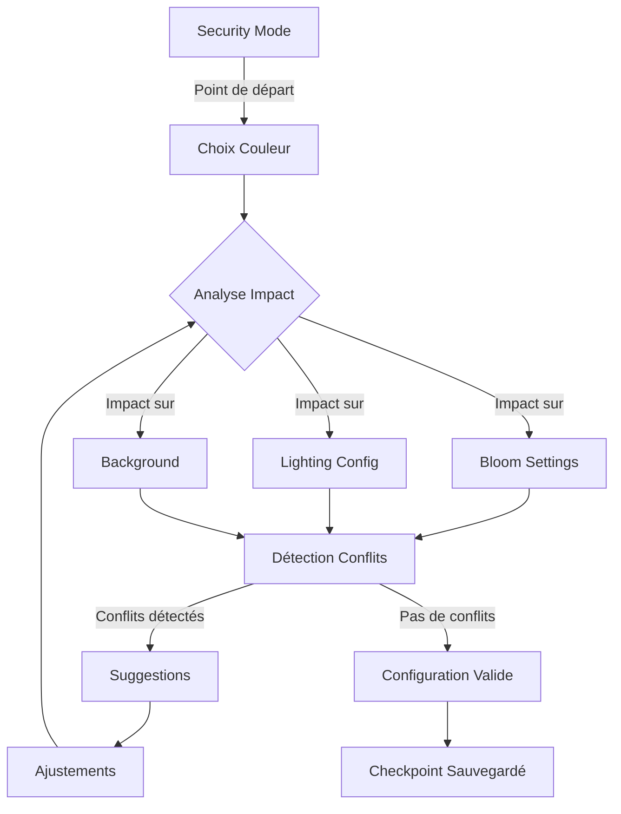

# 🎯 Plan d'Implémentation XState - Configuration Lab

## 📋 Vue d'Ensemble

### Problématique Identifiée
Le projet souffre de problèmes de synchronisation complexes entre plusieurs systèmes de rendu 3D :
- **Désynchronisation** entre les paramètres de bloom, lighting, background et PBR
- **Conflits non détectés** lors des ajustements de paramètres
- **Absence de rollback intelligent** pour revenir à des configurations précédentes
- **Incohérences visuelles** dues aux interdépendances non gérées

### Solution Proposée
Implémentation d'une machine d'état XState appelée "Configuration Lab" qui :
- ✅ Gère les interdépendances entre paramètres
- ✅ Permet des checkpoints et rollbacks
- ✅ Détecte automatiquement les conflits
- ✅ Suggère des corrections intelligentes
- ✅ Synchronise avec les stores Zustand existants

## 🔄 Flux de Travail Identifié



## 🚨 Problèmes Critiques à Résoudre

### 1. Synchronisation Manuelle Complexe
**Problème actuel :**
- Le hook `useXStateSync` synchronise manuellement XState ↔ Three.js
- Gestion individuelle de bloom groups (iris, eyeRings, revealRings, arms)
- Security overrides forcent le lighting au maximum sans notification

**Solution XState :**
- Machine d'état parallèle gérant automatiquement les synchronisations
- Services dédiés pour chaque groupe de paramètres
- Notifications automatiques des overrides

### 2. Dépendances Circulaires
**Chaîne de dépendances identifiée :**
```
Security Override → Force Lighting MAX → Bloom Invisible → Background Conflict
Bloom Groups → Material Emissive → PBR Rendering → Lighting Adjustment
Background Transparent → Bloom Visibility ↓ → Need Intensity ↑ → Affect Other Groups
```

**Solution XState :**
- Détection automatique des cycles de dépendances
- Système de priorités pour résoudre les conflits
- Suggestions contextuelles basées sur l'analyse d'impact

### 3. Absence de Validation Cross-Domain
**Problème actuel :**
- Chaque slice valide ses propres paramètres
- Pas de validation globale de cohérence
- Conflits découverts trop tard par l'utilisateur

**Solution XState :**
- Service de validation globale en temps réel
- Détection préventive des conflits
- Alertes avant application des changements problématiques

## 🏗️ Architecture Technique

### Machine Principale : Configuration Lab

```typescript
const configurationLabMachine = createMachine({
  id: 'configLab',
  initial: 'experimenting',
  context: {
    checkpoints: [],
    workingConfig: {
      security: false,
      color: null,
      bloom: { intensity: 1.0, strength: 1.0, threshold: 0.85 },
      lighting: { exposure: 1.0, threshold: 0.5, ambient: 0.3 },
      background: { type: 'color', value: '#000000' }
    },
    impactAnalysis: {
      lastChanged: null,
      affectedParameters: [],
      suggestions: []
    }
  },
  states: {
    experimenting: {
      type: 'parallel',
      states: {
        checkpointManager: { /* ... */ },
        impactAnalyzer: { /* ... */ },
        problemDetector: { /* ... */ }
      }
    }
  }
});
```

### Services Clés

1. **analyzeImpacts** : Analyse l'impact d'un changement sur les autres paramètres
2. **detectProblems** : Identifie les configurations problématiques
3. **validateCoherence** : Vérifie la cohérence globale
4. **suggestFixes** : Propose des corrections automatiques

## 📊 Cas d'Usage Identifiés

### Scénario 1 : Bloom Invisible
**Séquence problématique :**
1. User choisit couleur claire
2. Règle bloom intensity
3. Mais lighting exposure trop forte → bloom invisible
4. User doit recommencer

**Solution XState :**
- Détection automatique : "Bloom visibility < 30%"
- Suggestion : "Réduire exposure ou augmenter bloom intensity"
- Possibilité de rollback au checkpoint précédent

### Scénario 2 : Objets 3D Perdus
**Séquence problématique :**
1. User choisit background très clair
2. Ajuste lighting trop faible
3. Objets 3D disparaissent

**Solution XState :**
- Alerte immédiate : "Objets 3D risquent d'être invisibles"
- Action proposée : "Augmenter ambient lighting ou assombrir background"

### Scénario 3 : Security Mode Override
**Séquence problématique :**
1. User configure minutieusement bloom et lighting
2. Active security mode
3. Tout est override sans comprendre pourquoi

**Solution XState :**
- Notification : "Security mode va forcer lighting au maximum"
- Options : "Continuer" ou "Désactiver security mode"

## 🎯 Implémentation Progressive

### Phase 1 : Core Machine (Semaine 1)
- [ ] Créer la machine principale `configurationLabMachine`
- [ ] Implémenter le système de checkpoints
- [ ] Créer les actions de base (update parameters)

### Phase 2 : Services d'Analyse (Semaine 2)
- [ ] Service `analyzeImpacts`
- [ ] Service `detectProblems`
- [ ] Service `validateCoherence`

### Phase 3 : Intégration Zustand (Semaine 3)
- [ ] Adapter `useXStateSync` pour la nouvelle machine
- [ ] Synchroniser avec bloom/lighting/pbr slices
- [ ] Tests d'intégration

### Phase 4 : UI & UX (Semaine 4)
- [ ] Panneau de checkpoints
- [ ] Alertes de conflits
- [ ] Interface de suggestions

## 📝 Métriques de Succès

1. **Réduction des ajustements** : -50% de va-et-vient entre paramètres
2. **Détection précoce** : 100% des conflits détectés avant application
3. **Satisfaction utilisateur** : Configuration cohérente du premier coup
4. **Performance** : <16ms pour analyse d'impact en temps réel

## 🔗 Ressources

- [XState Documentation](https://xstate.js.org/docs/)
- [XState Visualizer](https://stately.ai/viz)
- [React Three Fiber](https://docs.pmnd.rs/react-three-fiber)

## 👥 Contributeurs

- @Dev-Moulin - Lead Developer
- Claude AI - Architecture & Analysis

---

*Document créé le : ${new Date().toISOString()}*
*Dernière mise à jour : ${new Date().toISOString()}*