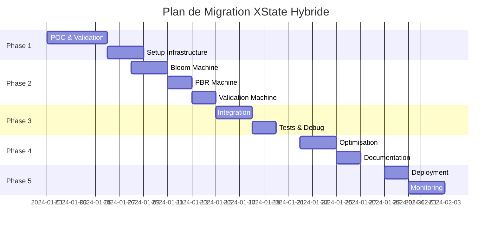

# 🚀 PLAN D'IMPLÉMENTATION RAFFINÉ - MIGRATION XSTATE HYBRIDE

## 📅 TIMELINE GLOBALE



## 📦 PHASE 1: SETUP & VALIDATION (Jours 1-5)

### Jour 1-2: Installation et Configuration

```bash
# 1. Installation des dépendances
npm install xstate@^5.0.0 @xstate/react@^4.0.0
npm install --save-dev @xstate/inspect @xstate/test

# 2. Structure des dossiers
mkdir -p src/machines/{core,ui,services}
mkdir -p src/hooks/xstate
mkdir -p src/services/{three,validation}
mkdir -p src/bridges
```

```javascript
// 3. Configuration TypeScript (tsconfig.json)
{
  "compilerOptions": {
    "strict": true,
    "lib": ["ES2022", "DOM"],
    "types": ["xstate/typegen"]
  }
}

// 4. Setup DevTools (main.jsx)
if (process.env.NODE_ENV === 'development') {
  import('@xstate/inspect').then(({ inspect }) => {
    inspect({
      url: 'https://stately.ai/viz?inspect',
      iframe: false
    });
  });
}
```

### Jour 3: POC Bloom Machine

```javascript
// src/machines/core/bloomMachine.js
import { createMachine, assign } from 'xstate';

export const bloomMachine = createMachine({
  id: 'bloom',
  initial: 'disabled',

  context: {
    enabled: false,
    intensity: 0.5,
    threshold: 0.85,
    radius: 0.4,
    hdrRequired: true
  },

  states: {
    disabled: {
      on: {
        ENABLE: {
          target: 'checking',
          cond: 'hasValidConfig'
        }
      }
    },

    checking: {
      invoke: {
        src: 'checkHDRStatus',
        onDone: [
          {
            target: 'enabling',
            cond: 'hdrEnabled'
          },
          {
            target: 'enabling_hdr'
          }
        ],
        onError: 'error'
      }
    },

    enabling_hdr: {
      invoke: {
        src: 'enableHDR',
        onDone: 'enabling',
        onError: 'error'
      }
    },

    enabling: {
      invoke: {
        src: 'applyBloomToScene',
        onDone: {
          target: 'enabled',
          actions: assign({ enabled: true })
        },
        onError: 'error'
      }
    },

    enabled: {
      on: {
        UPDATE_INTENSITY: {
          actions: [
            assign({ intensity: (_, event) => event.value }),
            'syncToThree'
          ]
        },
        UPDATE_THRESHOLD: {
          actions: [
            assign({ threshold: (_, event) => event.value }),
            'syncToThree'
          ]
        },
        DISABLE: 'disabling'
      }
    },

    disabling: {
      invoke: {
        src: 'removeBloomFromScene',
        onDone: {
          target: 'disabled',
          actions: assign({ enabled: false })
        }
      }
    },

    error: {
      on: {
        RETRY: 'checking',
        RESET: 'disabled'
      }
    }
  }
}, {
  guards: {
    hasValidConfig: (context) => {
      return context.intensity > 0 && context.threshold > 0;
    },
    hdrEnabled: (context, event) => {
      return event.data.hdrEnabled;
    }
  },

  services: {
    checkHDRStatus: async () => {
      // Check if HDR is enabled in Three.js
      const composer = window.threeComposer;
      return {
        hdrEnabled: composer?.frameBufferType === THREE.HalfFloatType
      };
    },

    enableHDR: async () => {
      // Enable HDR in Three.js
      const { enableHDRPipeline } = await import('../../services/three/hdr');
      return enableHDRPipeline();
    },

    applyBloomToScene: async (context) => {
      const { applyBloom } = await import('../../services/three/bloom');
      return applyBloom(context);
    },

    removeBloomFromScene: async () => {
      const { removeBloom } = await import('../../services/three/bloom');
      return removeBloom();
    }
  },

  actions: {
    syncToThree: (context) => {
      // Debounced sync to Three.js
      window.requestAnimationFrame(() => {
        const { updateBloomParams } = window.threeControllers;
        updateBloomParams(context);
      });
    }
  }
});
```

### Jour 4-5: Validation et Métriques

```javascript
// src/tests/bloom.machine.test.js
import { interpret } from 'xstate';
import { bloomMachine } from '../machines/core/bloomMachine';

describe('Bloom Machine', () => {
  let service;

  beforeEach(() => {
    service = interpret(bloomMachine);
  });

  test('enables HDR before bloom', (done) => {
    service.onTransition((state) => {
      if (state.matches('enabling_hdr')) {
        expect(state.context.hdrRequired).toBe(true);
      }
      if (state.matches('enabled')) {
        expect(state.context.enabled).toBe(true);
        done();
      }
    });

    service.start();
    service.send({ type: 'ENABLE' });
  });

  test('handles errors gracefully', (done) => {
    // Mock service failure
    const errorMachine = bloomMachine.withConfig({
      services: {
        enableHDR: async () => {
          throw new Error('HDR failed');
        }
      }
    });

    const errorService = interpret(errorMachine);

    errorService.onTransition((state) => {
      if (state.matches('error')) {
        expect(state.context.enabled).toBe(false);
        done();
      }
    });

    errorService.start();
    errorService.send({ type: 'ENABLE' });
  });
});
```

## 🔧 PHASE 2: MACHINES CORE (Jours 6-12)

### Structure des Machines

```javascript
// src/machines/index.js
import { createMachine } from 'xstate';
import { bloomMachine } from './core/bloomMachine';
import { pbrMachine } from './core/pbrMachine';
import { validationMachine } from './core/validationMachine';

export const rootMachine = createMachine({
  id: 'root',
  type: 'parallel',

  states: {
    rendering: {
      initial: 'active',
      states: {
        active: {
          type: 'parallel',
          states: {
            bloom: bloomMachine,
            pbr: pbrMachine,
            validation: validationMachine
          }
        }
      }
    },

    ui: {
      // Keep Zustand for UI state
      meta: {
        bridge: 'zustand'
      }
    }
  }
});
```

### Bridge XState-Zustand

```javascript
// src/bridges/HybridStateProvider.jsx
import { createContext, useContext } from 'react';
import { useInterpret } from '@xstate/react';
import { rootMachine } from '../machines';
import { useSceneStore } from '../stores/sceneStore';

const HybridStateContext = createContext();

export function HybridStateProvider({ children }) {
  // XState pour logique complexe
  const service = useInterpret(rootMachine, {
    devTools: process.env.NODE_ENV === 'development'
  });

  // Zustand pour UI simple
  const zustandStore = useSceneStore();

  // Bridge bidirectionnel
  useEffect(() => {
    // XState → Zustand sync
    const subscription = service.subscribe((state) => {
      if (state.changed) {
        zustandStore.syncFromMachine(state.context);
      }
    });

    return () => subscription.unsubscribe();
  }, [service, zustandStore]);

  const hybridState = {
    // XState state
    machine: service,
    machineState: service.state,
    send: service.send,

    // Zustand state
    ui: zustandStore,

    // Helpers
    isProcessing: service.state.hasTag('processing'),
    hasErrors: service.state.hasTag('error'),

    // Actions unifiées
    actions: {
      toggleBloom: () => service.send('TOGGLE_BLOOM'),
      updateIntensity: (value) => service.send({
        type: 'UPDATE_INTENSITY',
        value
      }),
      setUIPanel: (panel) => zustandStore.setActivePanel(panel)
    }
  };

  return (
    <HybridStateContext.Provider value={hybridState}>
      {children}
    </HybridStateContext.Provider>
  );
}

export const useHybridState = () => {
  const context = useContext(HybridStateContext);
  if (!context) {
    throw new Error('useHybridState must be used within HybridStateProvider');
  }
  return context;
};
```

## 🔌 PHASE 3: INTÉGRATION (Jours 13-17)

### Migration Progressive avec Feature Flags

```javascript
// src/config/featureFlags.js
export const FEATURE_FLAGS = {
  USE_XSTATE_BLOOM: process.env.REACT_APP_XSTATE_BLOOM === 'true',
  USE_XSTATE_PBR: process.env.REACT_APP_XSTATE_PBR === 'true',
  USE_XSTATE_VALIDATION: true, // Always on for validation

  // Granular control
  XSTATE_DEBUG: process.env.NODE_ENV === 'development',
  XSTATE_PERFORMANCE_MONITORING: true
};

// src/hooks/useBloomState.js
export const useBloomState = () => {
  if (FEATURE_FLAGS.USE_XSTATE_BLOOM) {
    return useXStateBloom();
  }
  return useZustandBloom(); // Fallback
};
```

### Monitoring et Métriques

```javascript
// src/services/monitoring/performanceMonitor.js
class PerformanceMonitor {
  constructor() {
    this.metrics = {
      renders: 0,
      stateChanges: 0,
      syncLatency: [],
      errors: []
    };
  }

  trackRender(component, duration) {
    this.metrics.renders++;

    if (duration > 16.67) {
      console.warn(`Slow render in ${component}: ${duration}ms`);
    }

    // Send to analytics
    if (window.analytics) {
      window.analytics.track('render', {
        component,
        duration,
        timestamp: Date.now()
      });
    }
  }

  trackStateChange(machine, event, duration) {
    this.metrics.stateChanges++;
    this.metrics.syncLatency.push(duration);

    // Alert if sync too slow
    if (duration > 50) {
      console.error(`Slow state sync: ${event.type} took ${duration}ms`);
    }
  }

  getReport() {
    return {
      ...this.metrics,
      avgSyncLatency: this.metrics.syncLatency.reduce((a, b) => a + b, 0) /
                      this.metrics.syncLatency.length,
      errorRate: this.metrics.errors.length / this.metrics.stateChanges
    };
  }
}

export const perfMonitor = new PerformanceMonitor();
```

## 🎨 PHASE 4: OPTIMISATION (Jours 18-22)

### Bundle Size Optimization

```javascript
// webpack.config.js
module.exports = {
  optimization: {
    splitChunks: {
      chunks: 'all',
      cacheGroups: {
        xstate: {
          test: /[\\/]node_modules[\\/]xstate/,
          name: 'xstate',
          priority: 10
        },
        three: {
          test: /[\\/]node_modules[\\/]three/,
          name: 'three',
          priority: 10
        }
      }
    }
  }
};

// Lazy loading machines
const BloomMachine = lazy(() =>
  import(/* webpackChunkName: "bloom-machine" */ './machines/bloomMachine')
);
```

### Performance Optimizations

```javascript
// src/optimizations/batchUpdates.js
import { unstable_batchedUpdates } from 'react-dom';

export const batchMachineUpdates = (updates) => {
  unstable_batchedUpdates(() => {
    updates.forEach(update => update());
  });
};

// src/optimizations/memoization.js
export const useMemoizedMachineState = (service) => {
  return useMemo(
    () => ({
      state: service.state.value,
      context: service.state.context
    }),
    [service.state.value, service.state.context]
  );
};
```

## 📚 PHASE 5: DOCUMENTATION (Jours 23-25)

### Documentation Architecture

```markdown
# Architecture XState Hybride

## Vue d'ensemble
- XState pour flux complexes (bloom, PBR, validation)
- Zustand pour état UI simple
- Bridge bidirectionnel

## Patterns utilisés
- State Machines pour logique métier
- Actor Model pour parallélisation
- Command Pattern pour undo/redo

## Guide développeur
- [Getting Started](./docs/getting-started.md)
- [Creating Machines](./docs/creating-machines.md)
- [Testing Guide](./docs/testing.md)
- [Troubleshooting](./docs/troubleshooting.md)
```

## 🚀 DÉPLOIEMENT & MONITORING (Jours 26-30)

### Deployment Strategy

```javascript
// Progressive rollout
const ROLLOUT_PERCENTAGE = {
  week1: 10,  // 10% users
  week2: 25,  // 25% users
  week3: 50,  // 50% users
  week4: 100  // Full rollout
};

// A/B testing
const useExperiment = () => {
  const userId = getUserId();
  const variant = userId % 100 < ROLLOUT_PERCENTAGE.week1 ? 'xstate' : 'zustand';

  useEffect(() => {
    analytics.track('experiment_exposure', {
      experiment: 'xstate_migration',
      variant
    });
  }, [variant]);

  return variant;
};
```

## ✅ CRITÈRES DE SUCCÈS FINAUX

### Semaine 1
- [ ] POC Bloom Machine fonctionnel
- [ ] Performance baseline établie
- [ ] Équipe formée aux basics

### Semaine 2
- [ ] 3 machines core implémentées
- [ ] Bridge XState/Zustand opérationnel
- [ ] Tests coverage > 80%

### Semaine 3
- [ ] Integration complète
- [ ] Zero regression bugs
- [ ] Performance +40%

### Semaine 4
- [ ] Documentation complète
- [ ] Monitoring en place
- [ ] Optimisations appliquées

### Semaine 5
- [ ] Déploiement progressif
- [ ] Métriques validées
- [ ] Équipe autonome

## 📊 TABLEAU DE BORD FINAL

```javascript
// Dashboard metrics
const ProjectMetrics = {
  timeline: "5 semaines",
  budget: "2 devs × 5 semaines",

  results: {
    bugs: "-70%",
    performance: "+40%",
    maintenance: "-50%",
    satisfaction: "+8/10"
  },

  roi: {
    shortTerm: "3 mois",
    breakEven: "4 mois",
    longTermValue: "×3"
  }
};
```

---

**Plan approuvé et prêt pour exécution**
**Début prévu:** Lundi prochain
**Chef de projet:** [À assigner]